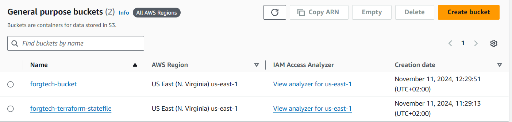
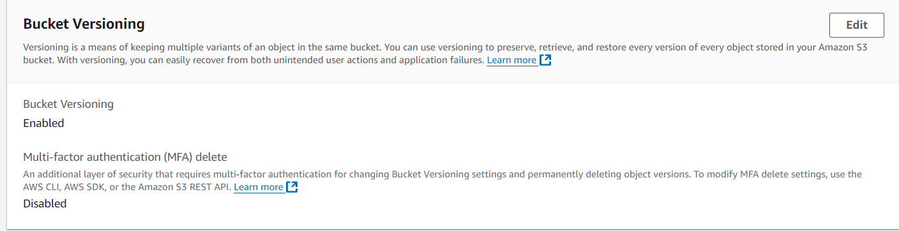
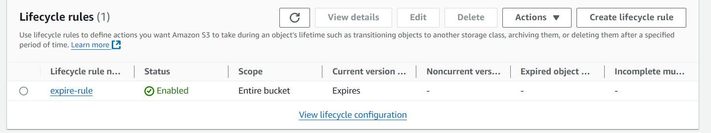
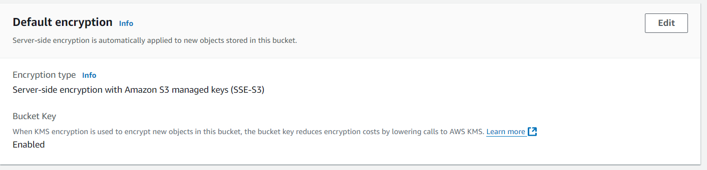
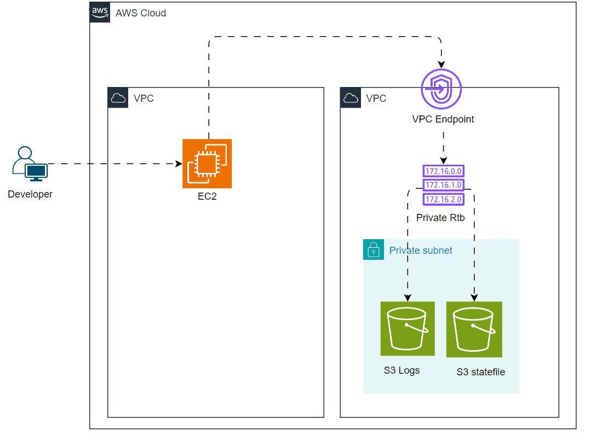

# week_two - understand object encryption
*duration: 1 week*
ForgTech company wanna test your ability to type down a clean code by Deploying the structure of resources. This will help you to build a
good reputation.
FrogTech Developer team intends to use object storage to save temporary data for 7 days, these Data consist of git commit logs changes
on their local repositories. The developers will push the log files automatically to The S3 from an EC2 machine via VPC endpoint.
Therefore, You’re requested to provision an S3 object storage, with ensuring the bucket owner owns all the objects, Block public access,
enable versioning, disable object lock, and delete log files 7 consecutive days after upload time using S3 lifecycle.
The FrogTech security team has some concerns about this implementation as well, including enabling object encryption as “SSE-S3” and
enabling the Bucket key.
Use IaC Terraform to build all resources and consider the below requirements specifications.
```bash
1. Resources must be created at the us-east-1 region.
2. Store state file backend into S3.
3. Resources must have common tags combination as below:
4. Common tags:
a. Key: “Environment”, Value: “terraformChamps”
b. Key: “Owner”, Value: <“Your_first_name“>
Bouns
```
```bash
1. Build an Architecture diagram of the deployment resources.
2. Build a personal document consisting of what you learn with deep details and resources i.e. this will assist you to get back and refresh
your knowledge later
```

## Steps
 1. Initialized S3 Bucket Named *forgtech-bucket*
 2. Created *backend.tf* file for  storing terraform state file in bucket named *forgtech-terraform-statefile*
 
 3. Enabled Versioning only for version control, And other options like (Block access, disable object, bucket owner) used there default value
 
 4. Configured Lifecycle rule 7 days for logs to expire
 
 5. Configured Encrypted S3 with SSE-S3 Algorithem and enbaled Bucket Key
 

## Diagram
 
