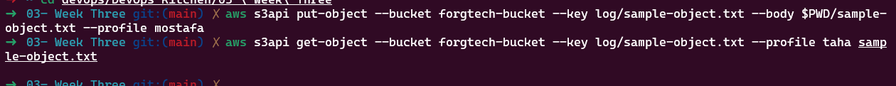

# Task 6

## Week_three - Access policies & CLI commands
duration: 1 week
ForgTech company wanna test your ability to type down a clean code by Deploying the structure of resources. This will help you to build a
good reputation.
The FrogTech Developer team intends to use object storage as a centralized storage, these Data consist of web applications log files. The
developers will push the log files automatically to The S3 from multiple places using IAM credentials.
Therefore, You’re requested to provision an S3 object storage and a directory called “logs,“ ensuring the bucket owner owns all the objects,
Block public access, enable versioning, disable object lock, as well as provision IAM user with the less privilege permissions as below:
1. Taha IAM user:
a. Hold an IAM Role consisting of s3:GetObject policy from the logs directory only.
2. Mostafa IAM user:
a. Hold an S3 Policy allowing to put objects (i.e. s3:PutObject ) at the entire S3.
After provisioning the required Resources, Check the user accessibility utilizing AWS CLI e.g. aws s3 command, and AWS CLI s3api
command.
The FrogTech security team has some concerns about this implementation as well, including enabling object encryption as “SSE-S3” and
enabling the Bucket key.
Use IaC Terraform to build all resources and consider the below requirements specifications.
1. Resources must be created at the us-east-1 region.
2. Store state file backend into S3.
3. Resources must have common tags combination as below:
4. Common tags:
a. Key: “Environment”, Value: “terraformChamps”
b. Key: “Owner”, Value: <“Your_first_name“>
*Bouns*
1. Build an Architecture diagram of the deployment resources.
2. Build a personal document consisting of what you learn with deep details and resources i.e. this will assist you to get back and refresh
your knowledge later

# Documentation 

## Steps
1. Created S3 Bucket with default values of (bucket owner owns all the objects,Block public access,Object lock), enabled versioning only for version control, and encrypted S3 object to *SSE-S3* and enabled Bucket Key
2. Created to IAM users (Taha, and Mostafa) with get object or upload object policy with access key so we can test it in AWS CLI

