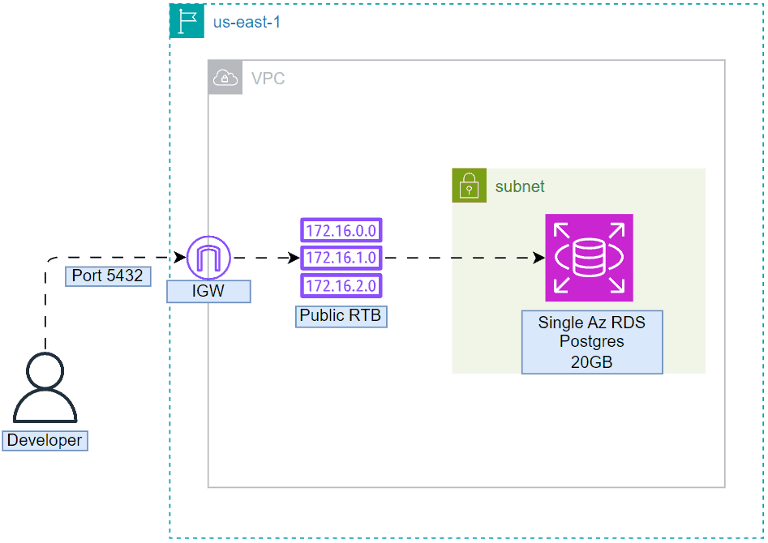

# Task 8
```bash
#week_five - Single RDS deployment
duration: 1 week
ForgTech company wanna test your ability to type down a clean code by Deploying the structure of resources. This will help you to build a
good reputation.
The FrogTech Database team intends to migrate the local PostgreSQL Database to RDS and to do so They need to test/descover The RDS
functionality first.
Therefore, You’re requested to provision a PostgreSQL RDS version >=15.* with the following requirement specifications:
1. allocate storage as 20.
2. instance_calss as db.t3.micro.
3. Allow public access i.e. for testing purposes.
4. Security Group allows all inbound traffic for 5432 port and allows all outbound traffic.
5. Set skip_final_snapshot as true.
6. Set multi_az as false.
After provisioning the required Resources, Check the user accessibility utilizing the pgAdmin application or Psql client command line.
Use IaC Terraform to build all resources and consider the below requirements specifications.
1. Resources must be created at the us-east-1 region.
2. Store state file backend into S3.
3. Resources must have common tags combination as below:
4. Common tags:
a. Key: “Environment”, Value: “terraformChamps”
b. Key: “Owner”, Value: <“Your_first_name“>
Bouns
1. Build an Architecture diagram of the deployment resources.
2. Build a personal document consisting of what you learn with deep details and resources i.e. this will assist you to get back and refresh
your knowledge later
3. Store backend into HCP instead
```
# Diagram



# Documentation

1. Created VPC, Route table, and Internet Gateway for enable accesing RDS
2. Enabled DNS hostname to attach hostname to each service, to easy communicate. Enabled DNS Resolution as well to resolve Hostname to IP 
3. Created Two Subnet, *forgtech-subnet* for RDS instance, *forgtech-subnetB* for  ```bash aws_db_subnet_group```resource because it require AZ requirment Az *at least 2 AZs*
4. Created Security group, that allows all inbound traffic for 5432 port and allows all outbound traffic
5. Created RDS  that allow allocated 20Gbs, public access, skip final snapshot, and no multi az

# Proof


