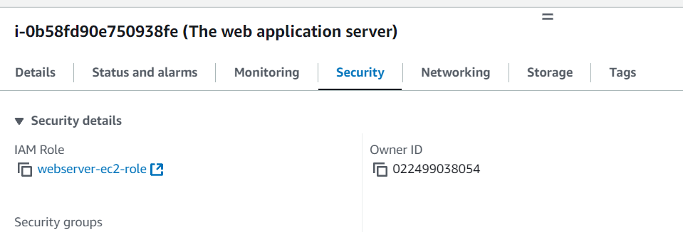
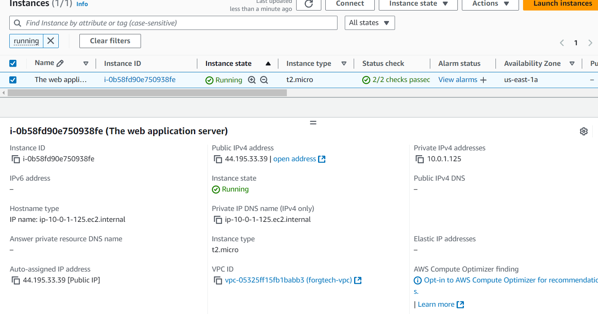
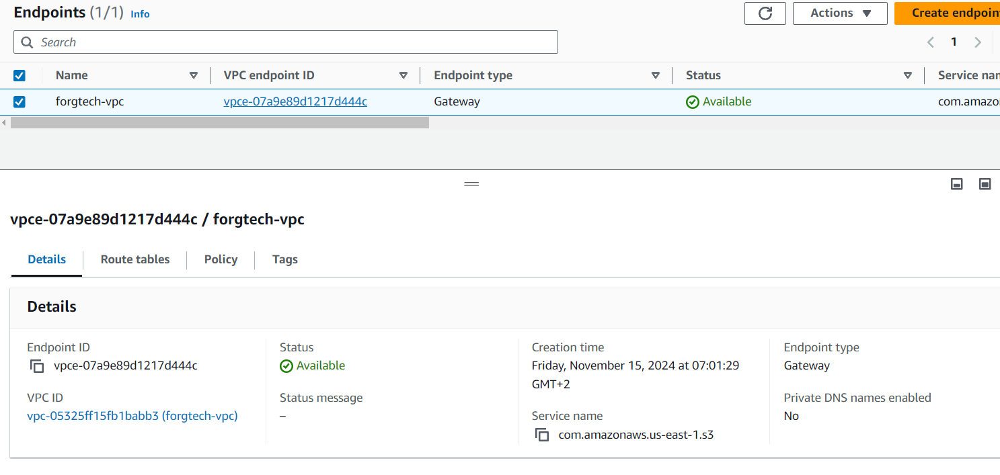
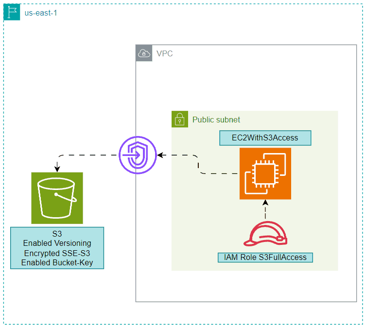

# TASK 7
## week_four - Accessing S3 via VPC Endpoint
duration: 1 week
ForgTech company wanna test your ability to type down a clean code by Deploying the structure of resources. This will help you to build a
good reputation.
The FrogTech Developer team intends to use object storage as a centralized storage for storing data, these Data consist of web applications
log files. The developers will push the log files automatically to The S3 from The Web application ec2 machine using VPC endpoint and IAM
Role credentials.
Therefore, You’re requested to provision an S3 object general purpose storage and a directory called “logs,“ ensuring the bucket owner
owns all the objects, Block public access, enable versioning, disable object lock, as well as provision a gateway VPC endpoint for The S3,
and provision an IAM Role, ec2 machine “i.e. The web application server“ Holds created IAM Role consisting of S3 full access AWS
managed policy.
After provisioning the required Resources, Check the user accessibility utilizing AWS CLI e.g. aws s3 command, and AWS CLI s3api
command.
The FrogTech security team has some concerns about this implementation as well, including enabling object encryption as “SSE-S3” and
enabling the Bucket key.
Use IaC Terraform to build all resources and consider the below requirements specifications.
1. Resources must be created at the us-east-1 region.
2. Store state file backend into S3.
3. Resources must have common tags combination as below:
4. Common tags:
a. Key: “Environment”, Value: “terraformChamps”
b. Key: “Owner”, Value: <“Your_first_name“>
Bouns
1. Build an Architecture diagram of the deployment resources.
2. Build a personal document consisting of what you learn with deep details and resources i.e. this will assist you to get back and refresh
your knowledge later

# Documentation
1. Created S3 with enabled Verisoning, and using other default value
2. Configured encryption for S3 Bucket and enabled Bucket Key
3. Created VPC with CIDR 10.0.0.0/16, public subnet, route table, internetgateway so i can connect to EC2
4. Created EC2 with auto assign IP and attached to Subnet and attach keypair to it
5. Created IAM-Role with attached S3Fullaccess
6. Created IAM instance profile so i can assign it to ec2

# Proof

# Diagram

