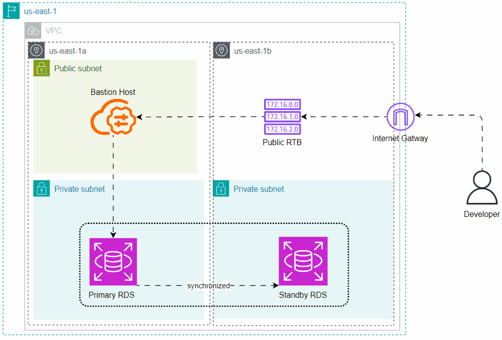
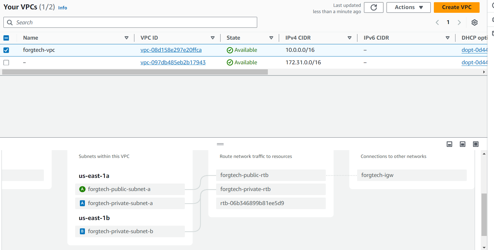
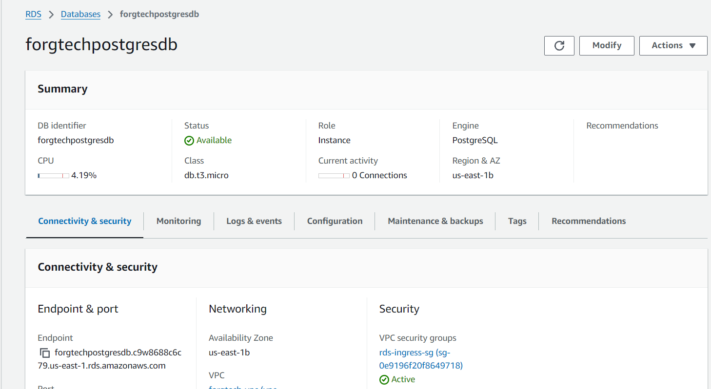
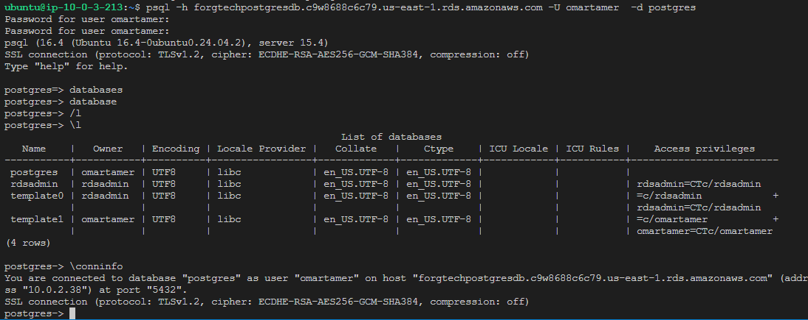

# Task 9
```bash
#week_six - multi-az RDS deployment
duration: 1 week
ForgTech company wanna test your ability to type down a clean code by Deploying the structure of resources. This will help you to build a
good reputation.
The FrogTech Database team determined to migrate the local PostgreSQL Database to AWS RDS, They have tested/discovered the RDS
functionality, Flaws, and parameter groups configuration.
Therefore, You’re requested to provision a Highly available Multi-az instance PostgreSQL RDS version >=15.*, The RDS Structure should
be as primary and standby without read replica, besides creating a Jumper server “bastion host“ to allow the Database team to connect to
The RDS. and consider the following requirement specifications:
1. allocate storage as 20 i.e. avoiding high cost.
2. instance_calss as db.t3.micro i.e. avoiding high cost.
3. Deny public access.
4. Both RDSs use the same Security group.
5. Security Group allows inbound traffic for 5432 port from the bastion host only. and allows all outbound traffic.
6. Set skip_final_snapshot as true.
After provisioning the required Resources, Check the user accessibility utilizing the pgAdmin application or Psql client command line from
the bastion host.
Use IaC Terraform to build all resources and consider the below requirements specifications.
1. Resources must be created at the us-east-1 region.
2. Store state file backend into S3.
3. Resources must have common tags combination as below:
4. Common tags:
a. Key: “Environment”, Value: “terraformChamps”
b. Key: “Owner”, Value: <“Your_first_name“>
Bonus
1. Build an Architecture diagram of the deployment resources.
2. Build a personal document consisting of what you learn with deep details and resources i.e. this will assist you to get back and refresh
your knowledge later
3. Store the backend into HCP instead.
4. Apply & destroy using planfile.

```
# Diagram



# Documentation

1. Created VPC, Route table, and Internet Gateway for accesing BastionHost
2. Enabled DNS hostname to attach hostname to each service, to easy communicate. Enabled DNS Resolution as well to resolve Hostname to IP 
3. Created Three Subnet, *forgtech-private-subnet-a* for Primary RDS instance, *forgtech-private-subnet-b* for standby that is synchronized, *forgtech-public-subnet-a* for bastion server
4. Created BastionHost (EC2), enabled auto assigned IP and attach ec2 to public subnet
5. Created two Security group, one that allow SSH (22) port in inbound and allow all traffic outbound, and one that allows traffic from Bastionhost Security Group allows all outbound traffic
6. Finally Created RDS  that allow allocated 20Gbs, skip final snapshot, and multi az

# Proof

```bash VPC```









