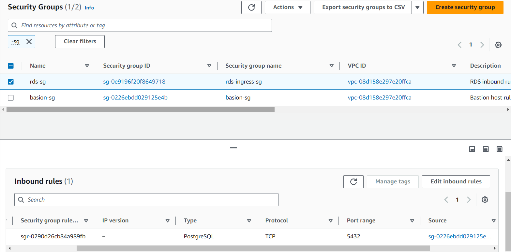
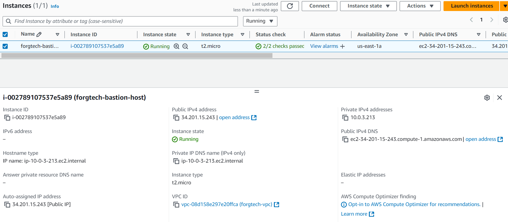
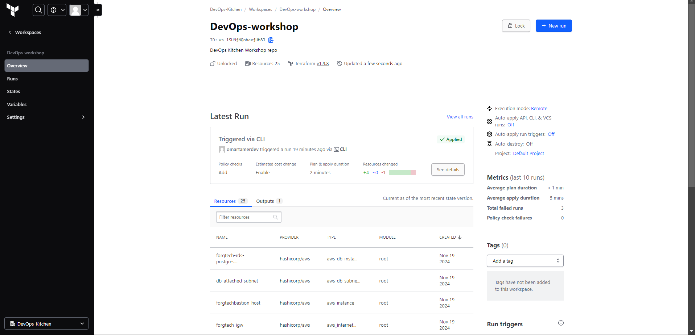

# Task 10

# Diagram


# Documentation

1. Created VPC, Route table, and Internet Gateway for accesing BastionHost
2. Enabled DNS hostname to attach hostname to each service, to easy communicate. Enabled DNS Resolution as well to resolve Hostname to IP 
3. Created Three Subnet, *forgtech-private-subnet-a* for Primary RDS instance, *forgtech-private-subnet-b* for standby that is synchronized, *forgtech-public-subnet-a* for bastion server
4. Created BastionHost (EC2), enabled auto assigned IP and attach ec2 to public subnet
5. Created two Security group, one that allow SSH (22) port in inbound and allow all traffic outbound, and one that allows traffic from Bastionhost Security Group allows all outbound traffic
6. Finally Created RDS  that allow allocated 20Gbs, skip final snapshot, multi az, blue/green deployment, copy tags, encrypt storage, use secret manager for password, and backup stratgies

# Proof

```bash VPC```


```bash SG```


```bash RDS```


```bash EC2```


```bash Postgress CLI```


```bash HCP```

